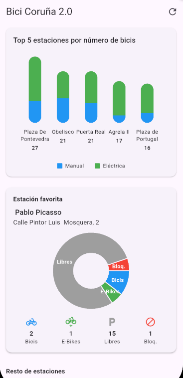
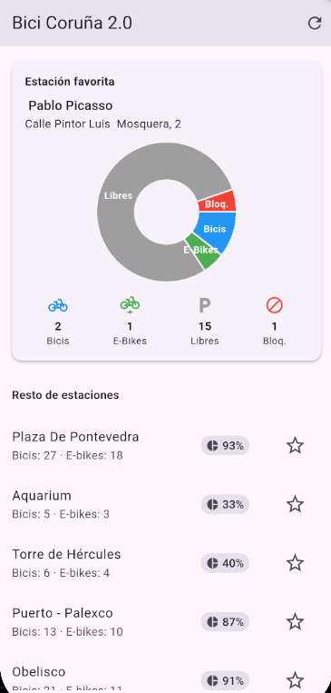
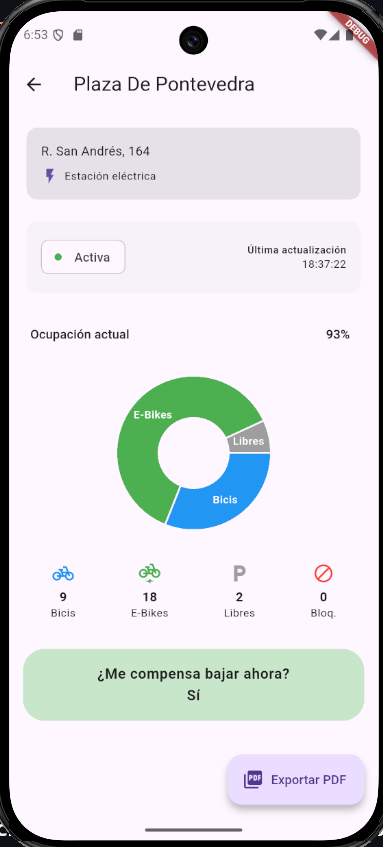
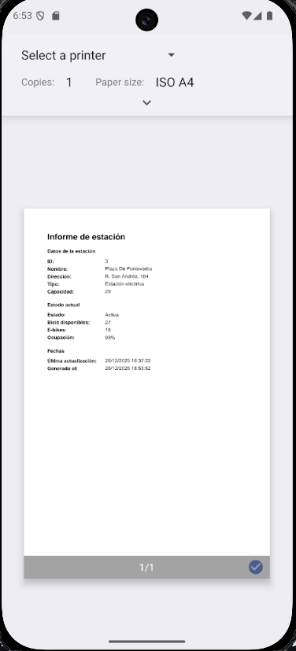
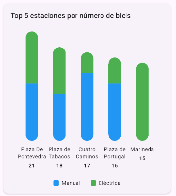
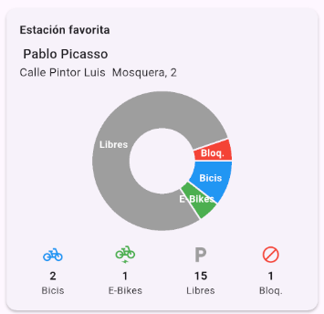

# Bici Coruña 2.0

Aplicación móvil desarrollada en **Flutter** que consume la API pública de biciCoruña para mostrar información estatica y dinamica sobre el estado de las estaciones de bicicletas.

---

## Enfoque del proyecto

El proyecto sigue una arquitectura **MVVM (Model – View – ViewModel)** para separar responsabilidades y mejorar la legibilidad del código.

Consta de dos pantallas una general y otra con detalles de la estación.

**home_screen**

    

Esta pantalla contiene un appBar en la que tenemos un boton que nos permite hacer la recarga de datos, debajo de esta tenemos un body que contiene una lista con todos los elementos, en esta lista, empezando desde la parte superior tenemos un grafico de columnas mostrando el top 5 estaciones con mas bicicletas, debajo tenemos un grafico circular con informacion sobre la ocupacion de la estacion seleccionada como favorita y debajo tenemso el resto de estaciones con un pequeño detalle de bicis disponibles y un porcentaje de ocupacion demas de icono de una estrella que permite marcalo como favorito, al pulsar nos llebara a los detalles de la estacion

**estacion_detail_screen** 

  

Esta pantalla contiene los detalles de la estación seleccionada, ademas de un elemento que segun la logica interna nos informa si nos compensa bajar ahora, en el final de la pagina tenemos un boton que nos permite experotar a pdf toda la informacion del la estacion sececcionada

---

## Gráficas elegidas

### Gráfica de barras – *Top 5 estaciones por número de bicicletas*

- Permite comparar rápidamente las estaciones con mayor disponibilidad.
- Al pulsar las barras permite acceder a detalles de la estación.
- Se ha puesto solo las barras, sin marcadores de altura para no saturar.

### Gráfica circular – *Ocupación de una estación*

- Representa la distribución de bicicletas, espacios disponibles y espacios bloqueados
- Permite visualizar proporciones de un total de forma intuitiva.
- Se reutiliza tanto en la vista de detalle como en la estación favorita.
- Permite pulsar sobre este elemento para ver detalles de la estaciñon

---

## Dependencias utilizadas

- **http**  
  Consumo de la API REST pública del sistema de bicicletas.

- **provider**  
  Gestión del estado de la aplicación siguiendo la arquitectura MVVM.

- **fl_chart**  
  Creación de gráficas de barras y circulares.

- **pdf**  
  Generación de informes en formato PDF con el detalle de una estación.

- **printing**  
  Visualización, impresión y exportación del PDF generado.

---
